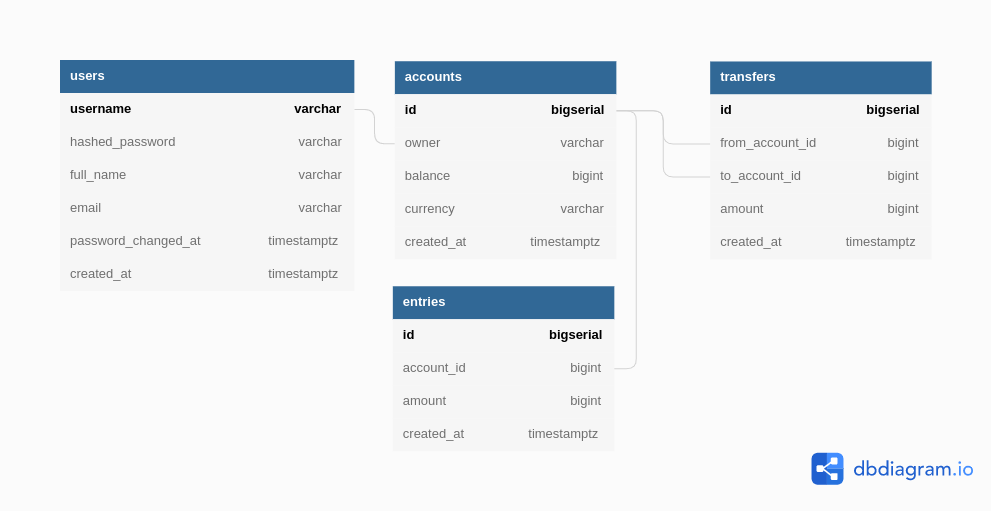

# go Simple Bank
Backend RESTFul API (Golang).
The service is a simple bank. It will provide APIs for the frontend to do following things:
1. Create and manage bank accounts, which are composed of owner’s name, balance, and currency.
2. Record all balance changes to each of the account. Every time some money is added to or subtracted from the account, an account entry record will be created.
3. Perform a money transfer between 2 accounts. 

## Database




## Installation
### Setup local development
+ Docker desktop
+ PgAdmin4

### Setup infrastructure
- Start postgres container:

    ```bash
    make postgres
    ```

- Create database:

    ```bash
    make createdb
    ```

- Run db migration up :

    ```bash
    make migrateup
    ```
### Run

- Run server and enjoy it:

    ```bash
    make server
    ```

## Tags
* Golang
* Postgres
* GoMock
* JWT
* Swagger

